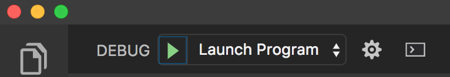

# Prime Project
This version uses React, Redux, Express, Passport, and PostgreSQL (a full list of dependencies can be found in `package.json`).

We **STRONGLY** recommend following these instructions carefully. It's a lot, and will take some time to set up, but your life will be much easier this way in the long run.

## Set up

### Prerequisites

Before you get started, make sure you have the following software installed on your computer:

- [Node.js](https://nodejs.org/en/)
- [PostrgeSQL](https://www.postgresql.org/)
- [Nodemon](https://nodemon.io/)

### Create Database and Table

Create a new database called `secure_submarine` and create a `person` table and `secret` table:

```SQL
CREATE TABLE "person" (
    "id" SERIAL PRIMARY KEY,
    "username" VARCHAR (80) UNIQUE NOT NULL,
    "password" VARCHAR (1000) NOT NULL,
    "clearance_level" INTEGER NOT NULL DEFAULT 0
);

INSERT INTO "person" ("username", "password", "clearance_level")
VALUES ('Admiral Greer', 'tuna', 18),
('Captain Borodin', 'shark', 10),
('Lieutenant Nguyen', 'fishy', 4),
('Lieutenant Ryan', 'tuna', 4);


CREATE TABLE "secret" (
    "id" SERIAL PRIMARY KEY,
    "content" VARCHAR (80) UNIQUE NOT NULL,
    "secrecy_level" INTEGER NOT NULL DEFAULT 0
);

INSERT INTO "secret" ("content", "secrecy_level")
VALUES ('Admirals Only: Captain Borodin is totally weird.', 13),
('Captains Or Above: Lieutenant Ryan is looking fly.', 6),
('Lieutenants Or Above: We are heading to the Bahamas.', 3);
```

### Download (Don't Clone) This Repository

* Don't Fork or Clone. Instead, click the `Clone or Download` button and select `Download Zip`.
* Unzip the project and start with the code in that folder.
* Create a new GitHub project and push this code to the new repository.

### Start the Application

* Start postgres if not running already by using `brew services start postgresql`
* Run `npm run server`
* Run `npm run client`
* Navigate to `localhost:3000`

### Debugging

To debug, you will need to run the client-side separately from the server. Start the client by running the command `npm run dev:client`. Start the debugging server by selecting the Debug button.


Then make sure `Launch Program` is selected from the dropdown, then click the green play arrow.



### Lay of the Land

* `src/` contains the React application
* `public/` contains static assets for the client-side
* `build/` after you build the project, contains the transpiled code from `src/` and `public/` that will be viewed on the production site
* `server/` contains the Express App

This code is also heavily commented. We recommend reading through the comments, getting a lay of the land, and becoming comfortable with how the code works before you start making too many changes. If you're wondering where to start, consider reading through component file comments in the following order:

* src/components
  * App/App
  * Footer/Footer
  * Nav/Nav
  * AboutPage/AboutPage
  * SecretsPage/SecretsPage
  * UserPage/UserPage
  * LoginPage/LoginPage
  * RegisterPage/RegisterPage
  * LogOutButton/LogOutButton
  * ProtectedRoute/ProtectedRoute

## Base Mode

On the Secure Submarine, there are many secrets, but our enemies are out to steal our secrets! We just realized that our Secure Submarine web portal (the portal for all of the hottest gossip on the secure submarine) is compromised! Anyone, logged in or not, can visit `http://localhost:5000/api/secret` to see all of the secrets for the entire crew!

Without authentication, a user should see no secrets.
With authentication, a user should only see secrets with a `secrecy_level` that is equal or less than the user's `clearance_level`

## Stretch Goals

### Hashing

If you're interested in securely storing passwords, you should salt and hash them. Here is a quick video that explains it pretty well: https://www.youtube.com/watch?v=8ZtInClXe1Q

Right now, we are storing the passwords in plain text, so if the enemy got a hold of our database, they would know everybody's password! Instead of storing plain passwords, we should scramble them up. That is called hashing.

Uncomment this line to start hashing passwords for each user.
    
```JavaScript
return bcrypt.hashSync(password, '$2b$10$p5Wkte33hlOBOcUtJie6H.');
```

Because the database doesn't store the actual password, we can't just check to see if they are equal like we were doing before. Uncomment this line to allow us to check `candidatePasswords` (what the user entered), against the `storedPassword` (the hash in the database).

```JavaScript
return bcrypt.compareSync(candidatePassword, storedPassword);
```


New users will now have their passwords hashed!

Run these queries to add your users back to the database with hashed passwords:

```SQL
DROP TABLE "person";

CREATE TABLE "person" (
    "id" SERIAL PRIMARY KEY,
    "username" VARCHAR (80) UNIQUE NOT NULL,
    "password" VARCHAR (1000) NOT NULL,
    "clearance_level" INTEGER NOT NULL DEFAULT 0
);

INSERT INTO "person" ("username", "password", "clearance_level")
VALUES ('Admiral Greer', '$2b$10$p5Wkte33hlOBOcUtJie6H.PnCvk8v.KjZspVoAFtT7g5v5xK.EXVG', 18),
('Captain Borodin', '$2b$10$p5Wkte33hlOBOcUtJie6H.ZIgFjzr4zY8FItxC8gZyqIWD5gYmL0m', 10),
('Lieutenant Nguyen', '$2b$10$p5Wkte33hlOBOcUtJie6H.vaUd5ikB1LWCbVZAA87BR63NiDorn1C', 4),
('Lieutenant Ryan', '$2b$10$p5Wkte33hlOBOcUtJie6H.PnCvk8v.KjZspVoAFtT7g5v5xK.EXVG', 4);
```

### Salting
Now that we are no longer storing plain text passwords. The enemy is unable to see the crew's passwords. However, Lieutenant Ryan has been careless, and the enemy knows that his password is `tuna`. Because of this, they can see the lowest security information. Then they notice that Admiral Greer's hashed password perfectly matches Lieutenant Ryan's hashed password! They now know that Admiral Greer's password is `tuna` as well! We should fix our code so that even if two people have the same password, it has a different hash in the database. Enter salting! Salting is the process of generating a random string for each user. Notice that every password starts with `$2b$10$p5Wkte33hlOBOcUtJie6H.`. That is the salt! These should be random and generated uniquely for each user.

Uncomment these two lines to start creating a unique salt for each user.

```JavaScript
const salt = bcrypt.genSaltSync(SALT_WORK_FACTOR); // This generates a random salt
```

```JavaScript
return bcrypt.hashSync(password, salt);
```

New users will now have their passwords salted and hashed!

Run these queries to add your users back to the database with hashed passwords:

```SQL
DROP TABLE "person";

CREATE TABLE "person" (
    "id" SERIAL PRIMARY KEY,
    "username" VARCHAR (80) UNIQUE NOT NULL,
    "password" VARCHAR (1000) NOT NULL,
    "clearance_level" INTEGER NOT NULL DEFAULT 0
);

INSERT INTO "person" ("username", "password", "clearance_level")
VALUES ('Admiral Greer', '$2b$10$uxPm0qeJAz70oqhEg8dX6uXlYc2PWUtPuZhTa65OiDv2LCHA41OLq', 18),
('Captain Borodin', '$2b$10$iUCrWSMvLpYuKQLsmmTiNe3gfU6jAdyElCbCLtboVH6DlXJdsuPxG', 10),
('Lieutenant Nguyen', '$2b$10$/3yhbbjXPPf3L4Z1gXDA5OJzJkf6b.2CuvIA8OzP6c8jPEQlbo5re', 4),
('Lieutenant Ryan', '$2b$10$hr1Tlo6K.yxAq3FC4iIHsuYQwYpjQC8SyDnYykMu/LNB9TXMkxMt2', 4);
```

Admiral Greer and Lieutenant Ryan still have the same passwords as before, but it's not easy to see that because of salting and hashing.

### Create an Environment Variable
`SERVER_SESSION_SECRET` is supposed to be a secret, but right now we are pushing it to GitHub! Let's create an environment variable so that we don't do this.

* Uncomment `// return process.env.SERVER_SESSION_SECRET;` in `session-middleware.js`
* Run `npm install dotenv` to get the node module that can create environment variables
* Add the line `require('dotenv').config();` to the top of `server.js` to use the module
* add `.env` to your `.gitignore` file
* Create a `.env` file at the root of the project and paste this line into the file:
    ```
    SERVER_SESSION_SECRET=superDuperSecret
    ```
    While you're in your new `.env` file, take the time to replace `superDuperSecret` with some long random string like `25POUbVtx6RKVNWszd9ERB9Bb6` to keep your application secure. Here's a site that can help you: [https://passwordsgenerator.net/](https://passwordsgenerator.net/).

### Production Build

Before pushing to Heroku, run `npm run build` in terminal. This will create a build folder that contains the code Heroku will be pointed at. You can test this build by typing `npm start`. Keep in mind that `npm start` will let you preview the production build but will **not** auto update.

* Start postgres if not running already by using `brew services start postgresql`
* Run `npm start`
* Navigate to `localhost:5000`

### Deployment

1. Create a new Heroku project
1. Link the Heroku project to the project GitHub Repo
1. Create an Heroku Postgres database
1. Connect to the Heroku Postgres database from Postico
1. Create the necessary tables
1. Add an environment variable for `SERVER_SESSION_SECRET` with a nice random string for security
1. In the deploy section, select manual deploy

### Update Documentation

Customize this ReadMe and the code comments in this project to read less like a starter repo and more like a project. Here is an example: https://gist.github.com/PurpleBooth/109311bb0361f32d87a2
